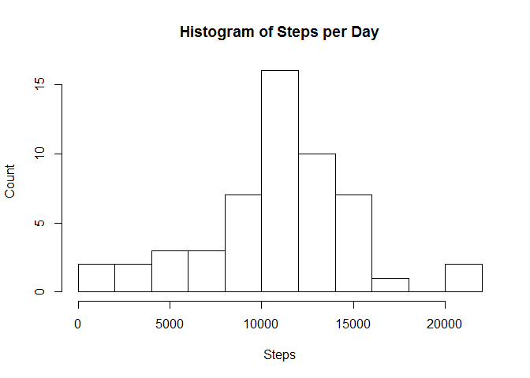
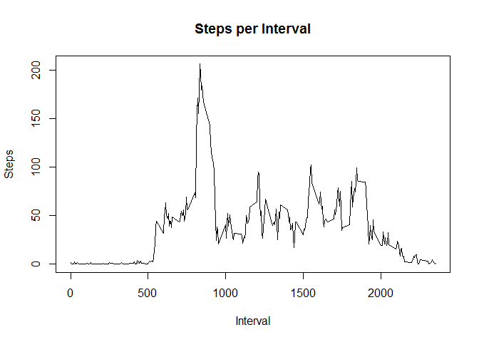
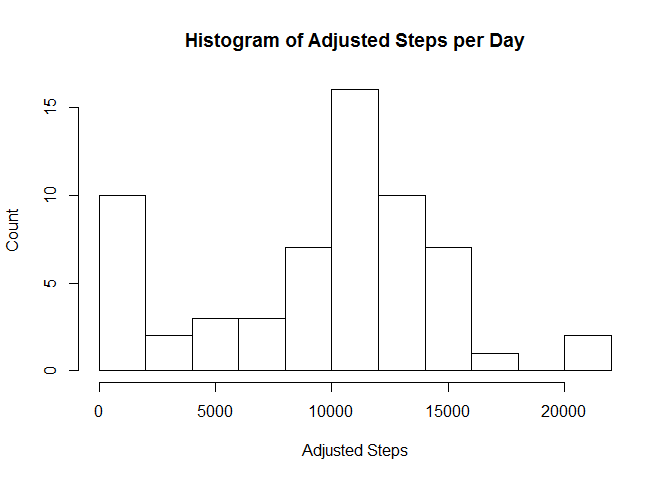
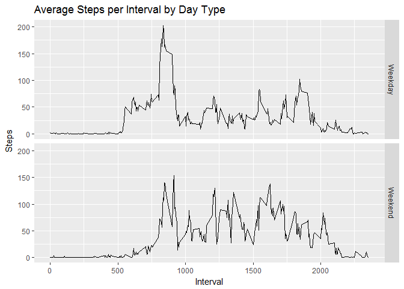

# Reproducible Research: Peer Assessment 1


## Loading and preprocessing the data
1. First I set the file URL, download the file, record when it was downloaded, unzip the file and load it into R.
    
    ```r
    fileUrl <- "https://d396qusza40orc.cloudfront.net/repdata%2Fdata%2Factivity.zip"
    download.file(fileUrl, destfile = "activity.zip")
    dateDownloaded <- date()
    
    unzip("activity.zip")
    
    data <- read.csv("activity.csv")
    
    str(data)
    ```
    
    ```
    ## 'data.frame':	17568 obs. of  3 variables:
    ##  $ steps   : int  NA NA NA NA NA NA NA NA NA NA ...
    ##  $ date    : Factor w/ 61 levels "2012-10-01","2012-10-02",..: 1 1 1 1 1 1 1 1 1 1 ...
    ##  $ interval: int  0 5 10 15 20 25 30 35 40 45 ...
    ```
    
    ```r
    print(dateDownloaded)
    ```
    
    ```
    ## [1] "Fri Jan 06 13:15:49 2017"
    ```

## What is mean total number of steps taken per day?
1. Here I used the aggregate function to calculate the number of steps per day and saved into a new data frame to preserve the original data set.
    
    ```r
      spd <- aggregate(steps ~ date, data, sum)
    ```

2. Next I plotted a histogram of the calculated steps per day.
    
    ```r
      hist(spd$steps, breaks = 15, main = "Histogram of Steps per Day", xlab = "Steps", ylab ="Count")
    ```
    
    <!-- -->

3. Using the same calculated dataset of steps per day, I then calculated the overall mean and median.
    
    ```r
      mean_spd <- mean(spd$steps)
      med_spd <- median(spd$steps)
      print(mean_spd)
    ```
    
    ```
    ## [1] 10766.19
    ```
    
    ```r
      print(med_spd)
    ```
    
    ```
    ## [1] 10765
    ```

## What is the average daily activity pattern?
1. First I used the aggregate function to calculate the average steps per interval and then used that data to create a line plot showing a time series of average steps per interval.
    
    ```r
      spi <- aggregate(steps ~ interval, data, mean)
      plot(spi, type = "l", main = "Steps per Interval", xlab = "Interval", ylab = "Steps")
    ```
    
    <!-- -->

2. To determine which interval had the most steps, I used the whichmax function to subset the dataframe on the row with the max steps value.
    
    ```r
      max_int <- spi[which.max(spi$steps), ]
      print(max_int)
    ```
    
    ```
    ##     interval    steps
    ## 104      835 206.1698
    ```

## Imputing missing values
1. First I calculated and reported the total number of NA values using the is.na function and summing it (TRUE = 1)
    
    ```r
      na_steps <- sum(is.na(data$steps))
      print(na_steps)
    ```
    
    ```
    ## [1] 2304
    ```

2. I decided to replace NAs with the mean value for that interval.  I first calculated the mean for each interval then merged it with my original dataset using the interval to join and saved it into a new data frame to preserve my original data.
    
    ```r
      int_mean <- aggregate(steps ~ interval, data, mean)
      mdata <- merge(data, int_mean, by = "interval")
    ```

3. Next I replaced NA values with the mean value merged into the data frame in the previous dataset.  The warning received is expected because only the NA values are being replaced - not all values.
    
    ```r
      mdata$steps.x[which(is.na(mdata$steps.x))] <- mdata$steps.y
    ```
    
    ```
    ## Warning in mdata$steps.x[which(is.na(mdata$steps.x))] <- mdata$steps.y:
    ## number of items to replace is not a multiple of replacement length
    ```

4. Then I aggregated the new dataset to calculate steps per day and plotted a histogram showing the average steps per day.  Next I calculated the mean and median of the new dataset.  The values are different than previously calculated because 2,304 NA values from the original dataset were filled in.  Many of those were overnight where the interval mean was 0 which moved the median value lower. In contrast, the additional values overall moved the mean higher. These results were expected based on the data and the method chosen to replace NA values.
    
    ```r
      mdata_spd <- aggregate(steps.x ~ date, mdata, sum) 
      hist(mdata_spd$steps.x, breaks = 15, main = "Histogram of Adjusted Steps per Day", xlab = "Adjusted Steps", 
        ylab = "Count")
    ```
    
    <!-- -->
    
    ```r
      mdata_mean <- mean(mdata_spd$steps.x)
      mdata_median <- median(mdata_spd$steps.x)
      print(mdata_mean)
    ```
    
    ```
    ## [1] 9371.437
    ```
    
    ```r
      print(mdata_median)
    ```
    
    ```
    ## [1] 10395
    ```

## Are there differences in activity patterns between weekdays and weekends?
1. To create a factor variable in the dataset with 2 levels - "weekday" and "weekend", first I converted the date values to a date format and identified the day of week. Then I created a dataframe to map the day of the week to a value of either weekday or weekend. Then I merged that into my data frame using the day to join and added it into my dataset with the NAs replaced.
    
    ```r
      mdata$weekdays <- weekdays(as.Date(mdata$date, format = "%Y-%m-%d"))
      days <- c("Monday", "Tuesday", "Wednesday", "Thursday", "Friday", "Saturday","Sunday")
      wd_we <- c("Weekday", "Weekday", "Weekday", "Weekday", "Weekday", "Weekend", "Weekend")
      day_map <- data.frame(days = days, wd_we = wd_we)
      mdata <- merge(mdata, day_map, by.x = "weekdays", by.y = "days")
    ```

2. Next I aggregated the revised data by interval and type of day (weekend or weekday) to get the average steps per interval by type of day.  Then I used the ggplot2 package to create a facet grid showing a time series plot of steps per interval based on type of day.
    
    ```r
      mdata_spid <- aggregate(steps.x ~ interval + wd_we, mdata, mean)
      library("ggplot2")
      ggplot(data = mdata_spid, aes(x = interval, y = steps.x)) + geom_line() + facet_grid(wd_we ~.) + ggtitle("Average Steps per Interval by Day Type") + xlab("Interval") + ylab("Steps")
    ```
    
    <!-- -->
  
